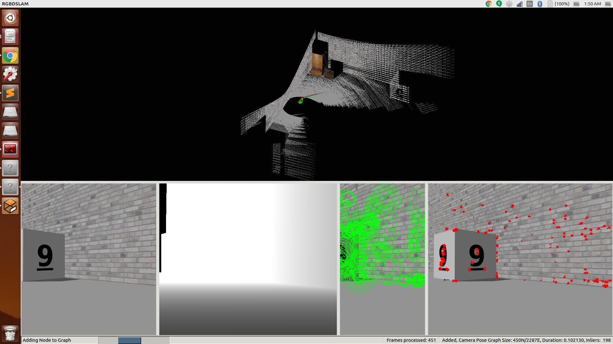

<h1 align=center> Marauders Map </h1>
<p align="center">

<a href="https://travis-ci.org/karanvivekbhargava/marauders_map">
</a>
<a href='https://coveralls.io/github/karanvivekbhargava/marauders_map?branch=master'>
</a>
<a href='https://opensource.org/licenses/MIT'>
</p>



## Overview

The Marauders Map product by Acme Robotics is one of its flagship products. It performs best for an indoor environment where you need to map an environment. It is a turtlebot package which utilizes rgbdslam_v2 ros package and an exploratory behaviour to map indoor environments to an octree format.

## License

This project is under the [MIT License](https://github.com/karanvivekbhargava/marauders_map/blob/master/LICENSE).

## SIP process

Since this project was built alone, I have followed the solo iterative process (SIP).

Log details for the same can be found [here](https://docs.google.com/spreadsheets/d/1UN-LUKyeZunZTpRnJA9aYaXh8SntVCdyPhzmPg2l0AY/edit#gid=0)

Planning notes can be found [here](https://docs.google.com/document/d/1BU2oDnlLBrMnNgZKm1wX3ZKhkwUWr54Su3-iXXmer3M/edit?usp=sharing)

## Dependencies
This project is dependent on:
* ROS Kinetic Kame
* Turtlebot ROS packages
* [rgbdslam_v2](https://github.com/felixendres/rgbdslam_v2) ROS package
* Ubuntu 16.04
* octovis [OPTIONAL] (used to view .ot files)

You may install rgbdslam_v2 from this [link](https://github.com/felixendres/rgbdslam_v2). However I've found some bugs in the code and have solved the same on my forked repository of rgbdslam_v2. I highly recommend to use the installation script given in this repository to install the same.

For ease of installation, I've modified the script from the main repository. This solves some of the commonly faced bugs during installation. To run the script follow the instructions below.

```
cd <path to repository>
chmod +x install.sh
./install.sh
```

This should start installing rgbdslam and all its dependencies in a pain free manner. After it's installed you need to source as follows.

```
source ~/Code/rgbdslam_catkin_ws/devel/setup.bash
```

Now you're all set to use rgbdslam with the turtlebot!

>[NOTE : These packages may be difficult to build. Please ensure they build properly before continuing]

## How does this work?

The activity diagram below contains a basic explanation of how the package is working. It has a node by the name `PathPlanner`. This node operates in the manner shown below. It keeps running and exploring the map using a simple algorithm till the user is satisfied with the map.

It uses the laserscan data to move around the environment. The robot goes straight till it encounters an obstacle which is nearer to it than a given threshold. The minimum distance from the laserscan data is published on the /minDistance topic. If there is an obstacle in the vicinity then the robot keeps turning till it finds a way to move forward again.

Once the user is satisfied with the map. They save the map using a service which is described below and kill the node. This is what is described in the activity diagram below.

<p align="center">

</p>

## Build Instructions

To build the ros node, follow the instructions given below.

```
mkdir -p ~/catkin_ws/src
cd ~/catkin_ws/
catkin_make
source devel/setup.bash
cd src/
git clone --recursive https://github.com/karanvivekbhargava/marauders_map.git
cd ..
catkin_make
```

## Running rostest
The unit tests have been written using gtest and rostest. To run the tests, you need to be in the catkin workspace parent folder. Then run the commands below

```
cd <path to catkin workspace>
catkin_make run_tests
```
You can test using
```
rostest marauders_map pathPlannerTest.launch
```

## Run Steps

To run the package with gazebo rendered custom world, you need to first build the project and then follow the instructions below.

```
source ~/Code/rgbdslam_catkin_ws/devel/setup.bash
cd <path to catkin workspace>
source devel/setup.bash
roslaunch marauders_map demo.launch
```

You will see several windows opening up. A new terminal will open up which will inform how the exploration package is moving. A new window for rgbdslam_v2 will open up and the gazebo environment will load up as well.


When the gazebo world is loaded, the turtlebot will start to turn. It will drive forward until it encounters an obstacle, at which point it will stop, turn in place until it sees no obstacle, and then continue to drive forward. This is maybe considered a "dumb" way to navigate, but in the desired use cases, the area may be completely unknown and the robot's task is to collect as much information as it can about its surrounding environment.

## Saving the map

Once you think you are satisfied with the map in the rgbdslam window after launching as instructed above, you have to run a service which will save the map.

Open a new terminal and source the rgbdslam as follows

```
source ~/Code/rgbdslam_catkin_ws/devel/setup.bash
```

Then we will call the rgbdslam service to save the octree map.

```
rosservice call /rgbdslam/ros_ui_s save_octomap ~/savedEnvironment.ot
```

You can change the path of `~/savedEnvironment.ot` to any other filename or path that you'd like.

[NOTE : Do not call this service more than three times. I've encountered an issue for the same. If you do this for more times then rgbdslam gives a process died error and exits]

## Viewing the map [OPTIONAL]

Since the output of the map is octree (.ot file), we can use the [octovis](http://wiki.ros.org/octovis) package to view the output.

This can be installed by running the following command. However I haven't completely tested it without installing octomap and the likes.

```
sudo apt-get install ros-kinetic-octovis
```

You would have to run the following command to view the result

```
octovis ~/savedEnvironment.ot
```

Kindly change the path accordingly if you changed it in the previous step.


## Record rosbag

To record rosbag you need to run the following

```
roslaunch marauders_map demo.launch record:=true
```

This will record a rosbag file into the results directory of this package.

[NOTE: This launch file will not record camera data, like RGB images and depth images, because the file size will become too large too quickly. If camera data is needed, rosbag will have to be run separately in another terminal.]

## Playback of rosbag

To play the recorded data follow the instructions below after starting a roscore command in a new terminal.

```
cd <path to repository>/results
rosbag play marauders_map.bag
```

>[NOTE: Gazebo should not be running when playing back with rosbag.]


## Doxygen Documentation

Although the repository contains the documentation, if you'd still like to generate it then follow the instructions below.

```
sudo apt-get install doxygen
sudo apt-get install doxywizard
doxywizard
```

Once doxywizard is open, select the workspace as the repository. Fill in the details as required and set the source code folder to the repository as well. Create a new folder in the repository and select that as the destination directory. Proceed with the default settings and generate the documentation.
